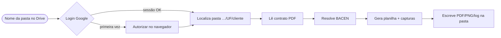

# Calculadora de Ação Crefaz

**Versão atual:** `v0.9.2` · **Cliente:** Rose Portal Advocacia  

Automatiza o cálculo de revisão de contratos **Crefaz**: você informa o **nome da pasta da cliente no Google Drive**; o app localiza a pasta, lê o **contrato em PDF**, obtém a **taxa BACEN** do período correto, preenche a **planilha de cálculo** e gera os **prints (PDF + PNG)** na própria pasta — prontos para conferência jurídica.

## ⚡ Versão Web (produção)

Desde 06/2026 roda **como web app** (a versão desktop `.exe` foi bloqueada pelo Smart App Control do Windows). Sem instalar nada:

| Camada | URL / onde | Stack |
|---|---|---|
| **Front** | https://revcalc.adventurelabs.com.br | Next.js na **Vercel** (root `web/`) |
| **Backend** | https://revcalc-api.adventurelabs.com.br | **FastAPI** em container no **xeon**, exposto via **Cloudflare Tunnel** (xeon é NAT, sem inbound) |
| **OAuth** | Google client **Web** (Workspace Rose, consent Internal) | secrets em Infisical `/clientes/03_ROSE` |

O **engine de cálculo** (`src/calculadora_crefaz/`) é o mesmo do desktop, rodando inalterado dentro do container — `server/` só embrulha em HTTP (OAuth server-side + SSE de progresso). O `templates/Calculo.xlsx` é o **entregável jurídico CONGELADO**; o Python só preenche inputs, o Excel calcula.

**Deploy:** backend `docker compose up -d --build` no xeon (`.env` renderizado do Infisical) + túnel `cloudflared` (systemd `--user`); front `vercel --prod` (rootDir `web`, env `NEXT_PUBLIC_API_BASE`). Detalhes em [`server/README.md`](server/README.md) e [`web/README.md`](web/README.md).

**Saída na pasta da cliente** (v0.9.0, sem numeração): `Calculo.xlsx` · `Calculo.pdf` · `imag.01.png` (Item II do contrato, recorte só da seção) · `imag.02.png` (bloco "Parcela com Taxa Média e Expurgo"). No fluxo **quitado** os dois primeiros viram `Calculo quitado.xlsx` · `Calculo quitado.pdf`.

### 🆕 Contratos quitados vs ativos (v0.9.0)

O app **detecta automaticamente** se o contrato é **quitado** (pago integralmente) ou **ativo**, pelos dados: se **todas as parcelas já venceram** (`parcelas_pagas >= prazo`, ou seja **0 a vencer**), trata como **quitado**.

| | Ativo | Quitado |
|---|---|---|
| Template | `templates/Calculo.xlsx` (aba `CÁLCULO`, modelo DADOS) | `templates/Calculo.quitado.xlsx` (abas `PRICE 24X/36x/48x/60x`, preenchimento direto) |
| Prazo suportado | 1–24 | 1–60 (cálculo retrospectivo: saldo zerado + montante cobrado a mais) |
| Saída | `Calculo.xlsx` / `Calculo.pdf` | `Calculo quitado.xlsx` / `Calculo quitado.pdf` |

O template quitado é **input-driven** (gerado de uma planilha hand-filled da Rose via [`scripts/limpa_template_quitado.py`](scripts/limpa_template_quitado.py), espelhando o padrão guardado da aba ativa): a lista de parcelas usa fórmulas `IF(idx>$I$qtd,"",…)` + datas `EDATE($D$1ºvenc, k)` até a capacidade de cada aba; a **matemática de recálculo** (bloco PMT, colunas AP/BL) é preservada intacta. **TAC** entra só em *DADOS DO CONTRATO*, não em *VALORES RECALCULADOS* (o recálculo já expurga a TAC do valor financiado).

### 📨 Feedback do usuário (v0.8.0)

A web tem uma **página de feedback** (`/feedback`, link no topo) onde o usuário escolhe o tipo
num dropdown — **Melhoria** (`feat`) · **Falha** (`bug`) · **Log de erro** (`erro_sistema`) ·
**Dúvida** (`duvida`) — e escreve a mensagem. Além disso, quando o **próprio sistema detecta um
erro** durante o cálculo (SSE cai, run falha), aparece um botão **"📨 Reportar este erro pra
equipe"** que envia em um clique (`origem=auto`, anexando as linhas de log da run).

**Destino:** Supabase `public.revcalc_feedback` (projeto `ftctmseyrqhckutpfdeq`), **não** GitHub.
Decisão: contém PII (advogados → dado financeiro de clientes), evita spam de issues nos
auto-reportes e mantém a triagem do nosso lado (promoção curada a issue do GitHub é manual).

**Segurança (least-privilege):** o backend insere via PostgREST com a **anon key** + uma policy
**INSERT-only** (`revcalc_feedback_insert_anon`) — **não** a service_role. A service_role
bypassaria o RLS do banco inteiro (Sueli, financeiro, Dino) e não deve viver num container
client-facing; se a anon vazar, só dá pra inserir feedback (não lê nada nem toca outra tabela).
A chave **nunca** vai ao browser (o front chama o backend). DDL em
[`db/revcalc_feedback.sql`](db/revcalc_feedback.sql) (aditiva/reversível). Se
`SUPABASE_URL`/`SUPABASE_ANON_KEY` não estiverem setados, `/api/feedback` responde 503 e o resto
do app segue normal.

Endpoints: `GET /api/feedback/config` (`{enabled}`) · `POST /api/feedback` (sessão obrigatória).

> As seções abaixo descrevem o **fluxo desktop legado** (`.exe`/PyInstaller) — mantidas como referência; o caminho atual é a web acima.

**Docs adicionais (detalhes e edge cases):**

- Técnico / PyInstaller / estrutura do repo → [`README_DEV.md`](README_DEV.md)
- Fluxo pensado para quem só instala binário + kit Rose → [`cliente-kit/README_USUARIO_FINAL.md`](cliente-kit/README_USUARIO_FINAL.md)

[](https://github.com/adventurelabsbrasil/revcalc/actions/workflows/tests.yml)
[](https://github.com/adventurelabsbrasil/revcalc/releases)
[](https://github.com/adventurelabsbrasil/revcalc/archive/refs/heads/main.zip)

---

## O que o sistema faz (resumo)

1. Login **Google OAuth** (contas autorizadas na configuração do app).
2. Busca da pasta da cliente em `EMPRESTIMO DE ENERGIA/<UF>/<NOME>/` no Drive.
3. Leitura do **`09 Contrato Crefaz.pdf`**, parsing do Item II e dos dados financeiros.
4. Uso da taxa **BACEN** (PDF **`11 Series Temporais.pdf`** na pasta ou cópia do repositório central da Rose quando faltar).
5. Geração do **`10 Cálculo …xlsx`**, **`12 Log.txt`** (append) e arquivos **`13 Print …`** (planilha + blocos regionais + trechos dos PDFs).

**Tempo médio:** cerca de 30–60 segundos por execução (rede + tamanho do PDF).

### Fluxo visual



**Sem LibreOffice instalado**, o app ainda gera **XLSX + log**, mas pode **omitir** as capturas `13 Print` até o LibreOffice ficar instalado e disponível ao processo (`soffice` no PATH no Windows/Linux).

---

## Como instalar (recomendado: terminal + código-fonte)

Use este fluxo quando quiser rodar **a mesma árvore que está na branch `main`**, sem depender de `.exe` na página de Releases.

### Pré-requisitos em qualquer sistema

| Item | Observação |
|------|------------|
| **Git** | Para `git clone`. |
| **Python 3.11+** | Obrigatório antes de qualquer comando `pip` ou `python -m …`. |
| **LibreOffice** | Necessário para gerar **`13 Print`**. Sem ele, só XLSX + log. |

**Credenciais Google OAuth:** o app espera arquivo de cliente/credencial conforme o projeto (`cliente_secret.json` ou variáveis `.env`). O detalhe de nomes de arquivo e scopes está em **`README_DEV.md`** — não commitar secrets.

---

### ⚠️ Windows: instale o Python **antes** do resto

Se o terminal disser que **`python` / `py` não é reconhecido**, nada do fluxo abaixo vai funcionar até corrigir isso.

1. Baixe o instalador oficial: [**python.org/downloads/windows**](https://www.python.org/downloads/windows/) (**Python 3.11 ou 3.12**).
2. Na primeira tela do instalador, marque **“Add python.exe to PATH”** e conclua a instalação.
3. **Feche e abra de novo** o CMD ou PowerShell (PATH só atualiza assim).
4. Confira:

```bat
py --version
```

ou

```bat
python --version
```

Alternativa pelo **winget** (CMD **como Administrador**):

```bat
winget install Python.Python.3.12
```

Depois disso, continue na seção **“Windows (clone e venv)”** abaixo.

---

### Windows (clone e venv)

Abra **CMD** ou **PowerShell** na pasta onde quer o projeto:

```bat
git clone https://github.com/adventurelabsbrasil/revcalc.git
cd revcalc

py -3.11 -m venv .venv
.venv\Scripts\activate
python -m pip install -U pip
pip install -e ".[dev]"
```

**(Opcional, recomendado para capturas)** — LibreOffice pelo `winget` (CMD **como Administrador**):

```bat
winget install --id TheDocumentFoundation.LibreOffice -e --source winget
```

Coloque **`soffice.exe`** no **PATH** (normalmente algo como  
`C:\Program Files\LibreOffice\program\`) ou o app pode não encontrar o conversor para PDF.

Rodar o app:

```bat
python -m calculadora_crefaz
```

**Gerar `.exe` localmente** (mesmo `pyinstaller.spec` do projeto):

```bat
pip install pyinstaller
pyinstaller pyinstaller.spec
```

O binário sai em **`dist\CalculadoraCrefaz.exe`**. Mais detalhes em [`README_DEV.md`](README_DEV.md).

---

### macOS / Linux (bash ou zsh)

```bash
git clone https://github.com/adventurelabsbrasil/revcalc.git
cd revcalc

python3.11 -m venv .venv
source .venv/bin/activate
python -m pip install -U pip
pip install -e ".[dev]"
```

**(macOS) LibreOffice:**

```bash
brew install --cask libreoffice
```

Rodar:

```bash
python -m calculadora_crefaz
```

---

### Sem Git: apenas ZIP da `main`

1. Baixe o ZIP: [`main.zip`](https://github.com/adventurelabsbrasil/revcalc/archive/refs/heads/main.zip) — extraia e entre na pasta `revcalc-main/`.
2. Execute os mesmos comandos **`venv`** + **`pip install -e ".[dev]"`** de cima dentro dessa pasta.

---

## Releases, `.exe` e kit Windows

A página [**Releases**](https://github.com/adventurelabsbrasil/revcalc/releases) pode trazer instaladores quando publicados. **Binário Windows pode não estar anexado** em toda versão — o caminho garantido até automatizarmos CI é **clone + venv acima**.

Alternativa já documentada para equipe Rose (script `instalar-e-testar`) está em **`cliente-kit/`** — ver [**`cliente-kit/README_USUARIO_FINAL.md`**](cliente-kit/README_USUARIO_FINAL.md).

---

## Como usar no dia a dia (após instalar)

1. Abrir o app (`python -m calculadora_crefaz` ou `.exe`).
2. **Entrar com Google** (primeira vez abre o navegador para autorização).
3. Digitar o **nome completo** da cliente **como aparece na pasta** no Drive (mínimo duas palavras).
4. **Calcular** — acompanhar o log na janela.
5. Conferir no Drive: **`10 …xlsx`**, **`12 Log.txt`**, **`13 Print …`** (quando LibreOffice disponível).

Estrutura típica de saída na pasta da cliente (`EMPRESTIMO DE ENERGIA/.../Nome/`):

```
├── 09 Contrato Crefaz.pdf
├── 10 Cálculo NOME.xlsx
├── 11 Series Temporais.pdf    (existente ou copiado pelo app)
├── 12 Log.txt
├── 13 Print CÁLCULO.pdf
├── 13 Print CÁLCULO.png
├── 13 Print 01 … 08 …        (capturas nomeadas pelo app)
└── …
```

---

## Mensagens comuns no log da UI

- **Sucesso:** `Pasta encontrada`, `Contrato lido`, `Pronto`.
- **Aviso:** BACEN copiado do repositório central; sobrescrever cálculo existente; capturas não geradas (LibreOffice ausente ou não detectado).

### Erros que interrompem o fluxo

| Sintoma rápido | O que conferir |
|----------------|----------------|
| Pasta não encontrada | Nome igual ao da pasta no Drive |
| Contrato não encontrado | Renomear para padrão com “Contrato Crefaz” no nome |
| BACEN não encontrado | Existência do PDF correspondente ao mês/ano esperado pela regra do app |
| Prazo não suportado | Template atual cobre até **24 parcelas** (Crefaz) |

Logout: botão **Sair** (limpa sessão local nesta máquina).

---

## Reportar problema

Envie nome da cliente, captura da janela com o log completo e data/hora. Evite editar manualmente o XLSX gerado para manter auditoria.

---

## Roadmap mencionado no produto

- **v0.7** — automatizar distribuição / build `.exe` em Releases (GitHub Actions)
- **v0.8** — pacote `.app` Mac mais polido
- **v0.9** — notificação pós-cálculo (ex.: Telegram), se política Rose permitir

---

© **2026** · **Adventure Labs** — Calculadora de Ação Crefaz · **v0.6.2**

---

## Terminal: quando “pip” ou “python” falham

Ao rodar `python -m calculadora_crefaz`, o projeto faz uma **checagem rápida** e imprime no terminal:

- **Banner** com Adventure Labs + versão (stderr).
- **Erro claro** se o Python for anterior ao 3.11 ou faltarem pacotes (`pip install …`).
- **Aviso** se não achar LibreOffice no PATH (capturas podem falhar — não bloqueia abrir o app).

**Dependências faltando:** na pasta `revcalc`, com `.venv` ativado:

```bat
pip install -U pip
pip install -e ".[dev]"
```

**Só para diagnóstico avançado:** ignorar a checagem (não recomendado):

```bat
set REVCALC_SKIP_PREFLIGHT=1
python -m calculadora_crefaz
```
