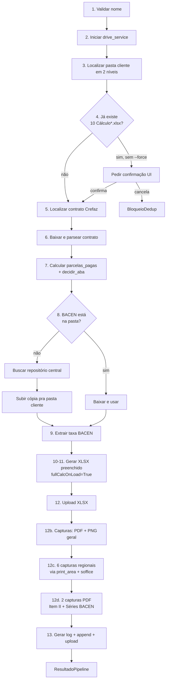

# Calculadora de Ação Crefaz — Documentação de Desenvolvimento

> Aplicação desktop Tkinter + Google Drive + openpyxl + LibreOffice headless. Cliente: **Rose Portal Advocacia**. Stack: Python 3.11+. MVP focado em rigor estrutural nos dados.
>
> Para documentação de **uso** pelo usuário final, ver [`README.md`](README.md).
> Estado atual e roadmap em [`docs/ESTADO_ATUAL.md`](docs/ESTADO_ATUAL.md).

---

## Stack

| Camada | Tecnologia |
|--------|-----------|
| UI | Tkinter (stdlib) com threading + queue para não bloquear o event loop |
| OAuth | `google-auth-oauthlib` (desktop loopback flow) + `keyring` (Keychain Mac, Cred Manager Win) |
| Drive | `google-api-python-client` v3, suporte a Drive Compartilhado |
| PDF parsing | `pdfplumber` (Item II do contrato; linhas BACEN) |
| XLSX | `openpyxl` (`load_workbook` + dual-mode DADOS/legacy) |
| Capturas | `LibreOffice` headless (`soffice --convert-to pdf`) + `pypdfium2` (rasterização) + `Pillow` (trim/crop) |
| Fuzzy match | `rapidfuzz` (sugestões de nome de pasta) |
| Distribuição | PyInstaller `--onefile --windowed` (Win + Mac) |
| Tests | `pytest` + `pytest-mock` |

---

## Setup local

```bash
cd apps/clientes/02_rose/calculo-acao-crefaz
python3.11 -m venv .venv
source .venv/bin/activate         # Windows: .venv\Scripts\activate
pip install -e ".[dev]"           # ou: pip install -r requirements.txt

cp .env.example .env              # editar com client_id + secret reais
```

### LibreOffice (necessário pras capturas v0.6.0+)

```bash
# macOS
brew install --cask libreoffice

# Linux
sudo apt install libreoffice

# Windows: baixar instalador em https://www.libreoffice.org/download/
```

Sem LibreOffice o app continua funcionando — XLSX e log são gerados normalmente, mas as capturas PNG/PDF emitem aviso e não saem.

### `.env`

```
GOOGLE_OAUTH_CLIENT_ID=<from Google Cloud Console>
GOOGLE_OAUTH_CLIENT_SECRET=<from Google Cloud Console>
```

OAuth client deve ser tipo **Desktop**, no projeto `roseportaladvocacia.com.br` (workspace internal). Domínios autorizados em `config.py`: `roseportaladvocacia.com.br` + `adventurelabs.com.br`.

---

## Rodar em dev

```bash
PYTHONPATH=src python -m calculadora_crefaz
```

**Mac shortcut:** `chmod +x abrir-calculadora-crefaz.command`, duplo-clique.

---

## Arquitetura

```
src/calculadora_crefaz/
├── __main__.py        # entry point: chama ui.main()
├── ui.py              # Tk app, threading, queue de log, dialogs
├── auth.py            # OAuth flow + keyring + refresh + domain check
├── drive.py           # listagem 2 níveis, dedup, download/upload, fuzzy
├── parser_contrato.py # Item II → DadosContrato (validação cruzada datas vs prazo)
├── parser_bacen.py    # taxa mensal do mês alvo
├── calculadora.py     # parcelas_pagas() + decidir_aba()
├── planilha.py        # gerar_xlsx() — dual-mode DADOS/legacy + fullCalcOnLoad
├── capturas.py        # capturas PDF + PNG (geral + 6 regionais + 2 PDFs)
├── log_writer.py      # 12 Log.txt — append + bloco BACEN destacado
├── config.py          # constantes, regex, mapeamentos, REGIOES_CALCULO, CAPTURAS_PDF
├── exceptions.py      # 11 classes tipadas pra errors com mensagem amigável
└── pipeline.py        # orquestra os 13 passos com callbacks pra UI/CLI

scripts/
├── aplica_v0.5.1.py        # patch cirúrgico template (já rodado em v0.5.6)
├── migrar_para_dados.py    # migração DADOS+visual (idempotente, v0.5.7)
└── fix_extends_v0.6.0.py   # patch merges + fórmulas AO/BP rows 147-155 (v0.6.0)

templates/
├── Calculo.xlsx              # template ativo v0.6.0 (DADOS oculta + CÁLCULO única)
├── Calculo.preDADOS.xlsx     # snapshot v0.5.6 cirúrgica (4 PRICE, sem DADOS)
├── Calculo.4abas-DADOS.xlsx  # snapshot v0.5.7 (4 PRICE + DADOS)
└── Calculo.original.xlsx     # snapshot v0.5.0 pré-cirúrgica
```

### Pipeline (v0.6.0)



### Dual-mode da planilha (desde v0.5.7)

`planilha.gerar_xlsx`:
- Detecta `"DADOS" in wb.sheetnames`.
- **Modo novo (template atual):** escreve só em `DADOS!B2:B14`. CÁLCULO tem fórmulas `=DADOS!$B$X` que resolvem ao abrir.
- **Modo legacy (template `Calculo.preDADOS.xlsx`):** escreve diretamente nas células PRICE 24X.
- Aplica `wb.calculation.fullCalcOnLoad = True` antes de salvar — força Excel/Sheets/LibreOffice a recalcular ao abrir.

### Capturas (v0.6.0)

`capturas.py` expõe 3 funções:

1. **`gerar_capturas(xlsx_bytes, nome_aba)`** — converte XLSX inteiro pra PDF (LibreOffice headless), rasteriza páginas como PNG. Retorna `CapturasGeradas(pdf_bytes, pngs)`.
2. **`gerar_capturas_regionais(xlsx_bytes, regioes, nome_aba)`** — pra cada `(label, range_xlsx)` em `regioes`, define print_area temporário, força altura mínima das rows, orientação adaptativa (portrait/landscape conforme aspect ratio), converte e aplica trim de whitespace via PIL. Retorna `list[CapturaPng]`.
3. **`capturar_pagina_pdf(pdf_bytes, marcador_regex, nome_arquivo)`** — extrai texto via pdfplumber, encontra a primeira página que casa o regex, renderiza pra PNG via pypdfium2.

`config.REGIOES_CALCULO` mapeia 6 blocos por range XLSX. `config.CAPTURAS_PDF` mapeia 2 trechos de PDF.

---

## Testes

```bash
pytest                          # tudo
pytest tests/test_planilha.py   # só planilha
pytest -k "ivan"                # filtrar por nome
```

Fixtures em `tests/fixtures/` são **gitignored** (PDFs de clientes reais com PII).

E2E mockado de referência: ver `_e2e_ivan/` (cliente IVAN DOS SANTOS sintético, 24 parcelas).

---

## Build

### Windows (.exe)

No próprio Windows:

```bash
.venv\Scripts\activate
pip install pyinstaller
pyinstaller pyinstaller.spec
```

Output: `dist/CalculadoraCrefaz.exe` (~50 MB single-file). Hidden imports do keyring já configurados pra Windows/Mac/Linux. Template embarcado via `--add-data`.

> O .exe **NÃO** embarca LibreOffice. A máquina destino precisa ter LibreOffice instalado pra capturas funcionarem. Sem ele, o app gera XLSX + log normalmente mas pula capturas.

### Mac (.app)

No macOS:

```bash
.venv/bin/pyinstaller --onefile --windowed \
    --name CalculadoraCrefaz \
    --add-data "templates/Calculo.xlsx:templates" \
    src/calculadora_crefaz/__main__.py
```

Output: `dist/CalculadoraCrefaz.app`. **Sem assinatura** — usuário tem que clicar com botão direito → "Abrir" → "Abrir mesmo assim" na primeira vez.

Pra produção real, precisa Apple Developer ID ($99/ano) + `codesign` + `notarytool`.

### CI/CD (futuro v0.7)

Plano: GitHub Actions Windows-only que dispara em `push tag v*`, roda `pyinstaller pyinstaller.spec`, cria GitHub Release com `.exe` anexado.

---

## OAuth: configuração no Google Cloud Console

1. Console → seu projeto → **APIs & Services → Credentials**
2. Create Credentials → OAuth client ID → **Desktop app**
3. Copiar `client_id` + `client_secret` pro `.env` local
4. **Authorized redirect URIs** não precisa configurar (loopback dinâmico)
5. **Scopes:** `https://www.googleapis.com/auth/drive`
6. **Domínio:** projeto deve estar em workspace `roseportaladvocacia.com.br` com OAuth consent screen tipo **Internal**

---

## Histórico de versões

| Versão | Data | Mudança |
|--------|------|---------|
| v0.5.0 | 2026-04-27 | MVP funcional inicial; 4 abas PRICE |
| v0.5.1-v0.5.5 | n/a | Saltos não documentados |
| v0.5.6 | 2026-04-28 | Patch cirúrgico template (extensão tabela 24X, IF+EDATE, page setup) |
| v0.5.7 | 2026-04-29 | DADOS+visual em 2 camadas; aba DADOS oculta + 4 PRICE |
| **v0.6.0** | **2026-04-29** | **Aba CÁLCULO única + capturas PDF/PNG (geral + 6 regionais + 2 PDFs) + fix extends rows 147-155** |

Detalhes em [`docs/ESTADO_ATUAL.md`](docs/ESTADO_ATUAL.md).

---

## Decisões arquiteturais cristalizadas

| ID | Decisão | Razão |
|----|---------|-------|
| D1 (rev. v0.6.0) | 1 aba visual única (CÁLCULO) | Crefaz só opera 1-24 parcelas; 4 PRICE eram código morto |
| D2 | `planilha.py` preservado | MVP enxuto |
| D3 | Zero identidade visual nova | Rigor nos dados, não cosmético |
| D4 | 6 seções jurídicas inalteradas | Conteúdo da Rose, não nosso |
| D5 | Validação técnica = Bruna Scopel + Advogada Bruna; Roselaine recebe ciência | Bug-finding por quem pode auditar |
| D6 | XLSX print-ready (paisagem A4 + fitToPage) | Ctrl+P direto vira PDF correto |
| D7 (v0.5.7) | DADOS+visual em 2 camadas | Separação dados-do-app vs layout-do-cliente |
| D8 (v0.6.0) | Capturas via LibreOffice headless | Funciona Mac/Win sem Excel instalado |

---

## Troubleshooting comum

### `ModuleNotFoundError: No module named 'tkinter'`

Python do brew não vem com Tkinter por padrão. Instalar:
```bash
brew install python-tk@3.11
```

### `keyring.errors.KeyringError` no Linux

`keyring` precisa de SecretService rodando. Em dev local Mac/Win não dá problema.

### `LibreOfficeIndisponivel` ao gerar capturas

`soffice` não está no PATH. Instalar conforme seção "Setup local". Capturas falham com aviso, mas XLSX e log são gerados normalmente.

### Token expirado e refresh falha

Apertar **"Sair"** no app, refazer login.

### PyInstaller no Mac falha com keyring

Adicionar a `pyinstaller.spec`:
```python
hiddenimports=[..., "keyring.backends.macOS"]
```

### Roselaine reporta `#NAME?` no XLSX

Drive renderiza Sheets que não suporta TODAS as fórmulas Excel. Se for `EDATE`, é suportado. Se for algo exótico, recomendar baixar XLSX e abrir no Excel.

### Capturas regionais cortando "= 439.75" final em CONFORME PACTUADO

Limitação conhecida — o template original tem rows 33-49 com altura 3pt usadas pra mesclagem da fórmula expandida. O script força altura mínima de 12-18pt mas pode não ser suficiente em casos extremos. O resultado final aparece no print geral. Refinar em v0.6.1 se necessário.

---

## Estrutura completa de arquivos

```
calculo-acao-crefaz/
├── README.md                      # documentação pra usuário final
├── README_DEV.md                  # este arquivo
├── pyproject.toml                 # PEP 621 + entry_point + setuptools (v0.6.0)
├── pyinstaller.spec               # build .exe Windows (e .app Mac)
├── requirements.txt
├── .env.example                   # template (commitado)
├── .env                           # gitignored — client_id + secret reais
├── .gitignore
├── conftest.py                    # config global pytest
├── abrir-calculadora-crefaz.command  # launcher Mac (bash)
├── docs/
│   ├── ESTADO_ATUAL.md            # fonte de verdade (vivo)
│   └── _obsoletos/                # docs históricos pré-v0.6.0
├── scripts/
│   ├── aplica_v0.5.1.py
│   ├── migrar_para_dados.py
│   └── fix_extends_v0.6.0.py
├── src/calculadora_crefaz/
│   └── ... (14 módulos)
├── templates/
│   ├── Calculo.xlsx               # ativo v0.6.0
│   ├── Calculo.preDADOS.xlsx
│   ├── Calculo.4abas-DADOS.xlsx
│   └── Calculo.original.xlsx
├── tests/
│   ├── fixtures/                  # gitignored
│   └── ...
└── _e2e_ivan/                     # E2E mockado de referência
```

---

*Mantenedor: Rodrigo Ribas (Adventure Labs). Cliente: Rose Portal Advocacia.*
