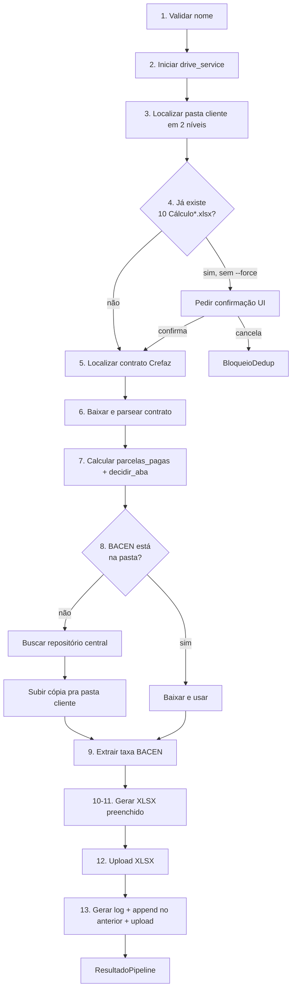

# Calculadora de Ação Crefaz — Documentação de Desenvolvimento

> Aplicação desktop Tkinter + Google Drive + openpyxl. Cliente: Rose Portal Advocacia. Stack: Python 3.11+. MVP focado em rigor estrutural nos dados (D3: zero cosmético).

Para documentação de **uso** pelo usuário final (Roselaine, Bruna), ver `README.md`.

---

## Stack

| Camada | Tecnologia |
|--------|-----------|
| UI | Tkinter (stdlib) com threading + queue para não bloquear o event loop |
| OAuth | `google-auth-oauthlib` (desktop loopback flow) + `keyring` (Keychain Mac, Cred Manager Win) |
| Drive | `google-api-python-client` v3, suporte a Drive Compartilhado |
| PDF parsing | `pdfplumber` (Item II do contrato; linhas BACEN) |
| XLSX | `openpyxl` (`load_workbook` + dual-mode DADOS/legacy detection) |
| Fuzzy match | `rapidfuzz` (sugestões de nome de pasta) |
| Distribuição | PyInstaller `--onefile --windowed` (Win + Mac) |
| Tests | `pytest` + `pytest-mock` |

---

## Setup local

```bash
cd apps/clientes/02_rose/calculo-acao-crefaz
python3.11 -m venv .venv
source .venv/bin/activate         # Windows: .venv\Scripts\activate
pip install -e ".[dev]"           # ou: pip install -r requirements.txt

cp .env.example .env              # editar com client_id + secret reais
```

### `.env`

```
GOOGLE_OAUTH_CLIENT_ID=<from Google Cloud Console>
GOOGLE_OAUTH_CLIENT_SECRET=<from Google Cloud Console>
```

OAuth client deve ser tipo **Desktop**, no projeto `roseportaladvocacia.com.br` (workspace internal). Domínios autorizados em `config.py`: `roseportaladvocacia.com.br` + `adventurelabs.com.br`.

---

## Rodar em dev

```bash
PYTHONPATH=src python -m calculadora_crefaz
```

**Mac shortcut:** `chmod +x abrir-calculadora-crefaz.command`, duplo-clique.

---

## Arquitetura

```
src/calculadora_crefaz/
├── __main__.py        # entry point: chama ui.main()
├── ui.py              # Tk app, threading, queue de log, dialogs
├── auth.py            # OAuth flow + keyring + refresh + domain check
├── drive.py           # listagem 2 níveis, dedup, download/upload, fuzzy
├── parser_contrato.py # Item II → DadosContrato (validação cruzada datas vs prazo)
├── parser_bacen.py    # taxa mensal do mês alvo
├── calculadora.py     # parcelas_pagas() + decidir_aba()
├── planilha.py        # gerar_xlsx() — dual-mode DADOS/legacy
├── log_writer.py      # 12 Log.txt — append + bloco BACEN destacado
├── config.py          # constantes, regex, mapeamentos
├── exceptions.py      # 11 classes tipadas pra errors com mensagem amigável
└── pipeline.py        # orquestra os 13 passos com callbacks pra UI/CLI

scripts/
├── aplica_v0.5.1.py        # patch cirúrgico template (já rodado)
└── migrar_para_dados.py    # migração DADOS+visual (idempotente)

templates/
├── Calculo.xlsx            # template ativo (DADOS+visual desde v0.5.7)
├── Calculo.preDADOS.xlsx   # snapshot v0.5.6 cirúrgica (reversão)
└── Calculo.original.xlsx   # snapshot v0.5.0 pré-cirúrgica (histórico)
```

### Pipeline (13 passos)



### Dual-mode da planilha (desde v0.5.7)

`planilha.gerar_xlsx`:
- Detecta `"DADOS" in wb.sheetnames`.
- **Modo novo (template atual):** escreve só em `DADOS!B2:B14`. PRICE tem fórmulas `=DADOS!$B$X` que resolvem ao abrir.
- **Modo legacy (template `Calculo.preDADOS.xlsx`):** escreve diretamente nas células PRICE via `celulas_para_aba(aba)`.

Mapeamento DADOS em `config.py:CELULAS_DADOS` (B2:B14 com 13 campos: título, datas, valores, taxas, parcelas pagas, data cálculo).

---

## Testes

```bash
pytest                          # tudo
pytest tests/test_planilha.py   # só planilha
pytest -k "adriano"             # filtrar por nome
pytest --no-header -q           # output limpo
```

Fixtures em `tests/fixtures/` são **gitignored** (PDFs de clientes reais com PII).

### Cobertura desejada

- `test_parser_contrato.py` — fixtures Adriano, Marlí, contratos com Prazo divergente das datas
- `test_parser_bacen.py` — fixtures BACEN multi-mês
- `test_calculadora.py` — meses_entre, parcelas_pagas, decidir_aba (boundaries)
- `test_planilha.py` — dual-mode (DADOS vs preDADOS) + assert formatos por tipo
- `test_log_writer.py` — append, separador, bloco BACEN destacado
- `tests/e2e/` — pipeline mockado (sem rede)

---

## Build

### Windows (.exe)

No próprio Windows:

```bash
.venv\Scripts\activate
pip install pyinstaller
pyinstaller pyinstaller.spec
```

Output: `dist/CalculadoraCrefaz.exe` (~40 MB single-file). Hidden imports do keyring já configurados pra Windows/Mac/Linux. Template embarcado via `--add-data`.

### Mac (.app)

No macOS:

```bash
.venv/bin/pyinstaller --onefile --windowed \
    --name CalculadoraCrefaz \
    --add-data "templates/Calculo.xlsx:templates" \
    src/calculadora_crefaz/__main__.py
```

Output: `dist/CalculadoraCrefaz.app`. **Sem assinatura** — usuário tem que clicar com botão direito → "Abrir" → "Abrir mesmo assim" na primeira vez (Gatekeeper).

Pra produção real, precisa Apple Developer ID ($99/ano) + `codesign` + `notarytool`.

### CI/CD (futuro v0.7)

Plano: GitHub Actions Windows-only que:
1. Dispara em `push tag v*`
2. Roda `pyinstaller pyinstaller.spec`
3. Cria GitHub Release com `.exe` anexado
4. Notifica Telegram (`ceo_buzz_Bot`)

---

## OAuth: configuração no Google Cloud Console

1. Console → seu projeto → **APIs & Services → Credentials**
2. Create Credentials → OAuth client ID → **Desktop app**
3. Copiar `client_id` + `client_secret` pro `.env` local
4. **Authorized redirect URIs** não precisa configurar (loopback dinâmico)
5. **Scopes:** `https://www.googleapis.com/auth/drive` (full Drive — necessário pra busca + upload)
6. **Domínio:** projeto deve estar em workspace `roseportaladvocacia.com.br` com OAuth consent screen tipo **Internal**

---

## Workflow de desenvolvimento

### Branch model

- `main` — produção, tagged com versões (v0.5.0, v0.5.6, v0.5.7…)
- `feat/*` — features em desenvolvimento

### Bump de versão

1. Atualizar `src/calculadora_crefaz/__init__.py` (`__version__`)
2. Atualizar `pyproject.toml` (`version`)
3. Atualizar `README.md` se houver mudança visível pro usuário
4. `git tag -a vX.Y.Z -m "..."`
5. `git push origin main && git push origin vX.Y.Z`

### Histórico de versões

| Versão | Data | Mudança principal |
|--------|------|-------------------|
| v0.5.0 | 2026-04-27 | MVP funcional |
| v0.5.1-v0.5.5 | n/a | (saltos não documentados — sessões Cowork não registradas) |
| v0.5.6 | ~2026-04-28 | Patch cirúrgico template (extensão tabela 24X, IF+EDATE, page setup uniforme) |
| v0.5.7 | 2026-04-29 | DADOS+visual (template em 2 camadas + dual-mode no `gerar_xlsx`) |

---

## Troubleshooting comum

### `ModuleNotFoundError: No module named 'tkinter'`

Python do brew não vem com Tkinter por padrão. Instalar via:
```bash
brew install python-tk@3.11
```

Ou usar Python oficial do python.org (vem com Tkinter built-in).

### `keyring.errors.KeyringError` no Linux

`keyring` precisa de SecretService rodando. No Ubuntu Server: `apt install gnome-keyring` ou usar fallback `keyring.backends.fail`. Em dev local Mac/Win não dá problema.

### Token expirado e refresh falha

Apertar **"Sair"** no app, refazer login. Se persistir, limpar manualmente:
```bash
python -c "import keyring; keyring.delete_password('calculadora-crefaz', 'ultimo-email')"
```

### LibreOffice ausente pra recalcular fórmulas em testes

Skill `xlsx` da Anthropic (em `~/.claude/skills/xlsx/scripts/recalc.py`) usa LibreOffice headless. No Mac:
```bash
brew install --cask libreoffice
```

### PyInstaller no Mac falha com keyring

Adicionar a `pyinstaller.spec`:
```python
hiddenimports=[..., "keyring.backends.macOS"]
```

### Roselaine reporta "fórmula `#NAME?`" no XLSX

Drive renderiza Sheets que não suporta TODAS as fórmulas Excel. Se for `EDATE`, é suportado. Se for algo exótico (raro neste projeto), pode ser limitação de Sheets — recomendar baixar XLSX e abrir no Excel.

---

## Decisões arquiteturais cristalizadas

| ID | Decisão | Razão |
|----|---------|-------|
| D1 | 4 abas PRICE (24X/36x/48x/60x), não 1 dinâmica | Menor risco de regressão visual; Roselaine acostumada |
| D2 | `planilha.py` preservado (sem refactor estrutural) | MVP enxuto |
| D3 | Zero identidade visual nova | "Rigor nos dados, não cosmético" |
| D4 | 6 seções jurídicas inalteradas | Conteúdo é da Rose, não nosso |
| D5 | Validação técnica = Bruna Scopel + Advogada Bruna (Rose), não Roselaine | Roselaine recebe ciência; bug-finding fica com quem pode fazer dump |
| D6 | XLSX print-ready (page setup uniforme A4 paisagem fitToWidth=1) | Ctrl+P no Excel da Rose vira PDF correto sem ajuste |
| D7 | DADOS+visual em duas camadas (v0.5.7) | Separação dados-do-app vs layout-do-cliente; abre porta pra v0.6 (xlwings render) |

---

## Roadmap

- **v0.6** — Capturas PNG automáticas (xlwings + Excel local) salvas como `13 Print *.png`
- **v0.7** — GitHub Actions Win-only build automático no `push tag`
- **v0.8** — `.app` Mac assinado + DMG profissional
- **v0.9** — Notificação Telegram (`ceo_buzz_Bot`) ao final de cada cálculo bem-sucedido
- **v1.0** — Code-signing Apple Developer ID + auto-update via Sparkle
- **v1.1** — Histórico estruturado em Supabase (substitui `12 Log.txt`)
- **v2.0** — Contratos quitados (cálculo retrospectivo)

---

## Estrutura completa de arquivos

```
calculo-acao-crefaz/
├── README.md                      # documentação pra usuário final
├── README_DEV.md                  # este arquivo
├── pyproject.toml                 # PEP 621 + entry_point + setuptools
├── pyinstaller.spec               # build .exe Windows (e .app Mac)
├── requirements.txt               # equivalente ao [project].dependencies do pyproject
├── .env.example                   # template (commitado)
├── .env                           # gitignored — client_id + secret reais
├── .gitignore
├── conftest.py                    # config global pytest
├── abrir-calculadora-crefaz.command  # launcher Mac (bash)
├── docs/
│   ├── HANDOFF_PLANILHA_DADOS_VS_VISUAL.md
│   ├── RELATORIO_MIGRACAO_DADOS.md
│   ├── PROMPT_CLI_RESIDUAL.md     # se ainda aplicável
│   └── ...
├── scripts/
│   ├── aplica_v0.5.1.py
│   └── migrar_para_dados.py
├── src/calculadora_crefaz/
│   └── ... (13 módulos, ver Arquitetura)
├── templates/
│   ├── Calculo.xlsx
│   ├── Calculo.preDADOS.xlsx
│   └── Calculo.original.xlsx
└── tests/
    ├── fixtures/                   # gitignored
    ├── e2e/
    ├── test_parser_contrato.py
    ├── test_parser_bacen.py
    ├── test_calculadora.py
    ├── test_planilha.py
    ├── test_log_writer.py
    └── test_drive.py
```

---

*Mantenedor: Rodrigo Ribas (Adventure Labs). Cliente: Rose Portal Advocacia.*
