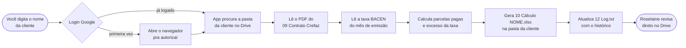

# Calculadora de Ação Crefaz

> Ferramenta interna da **Rose Portal Advocacia** que automatiza o cálculo de ações de revisão de contratos Crefaz. Você digita o nome da cliente, o app encontra a pasta no Drive, lê o contrato em PDF, busca a taxa BACEN do mês certo e gera a planilha de cálculo direto na pasta da cliente — pronta pra revisão.

---

## Como funciona



**Tempo médio:** 15 a 30 segundos por cálculo (depende da rede e do tamanho do contrato).

---

## Antes de começar

### O que você precisa

- **Conta de email da Rose** (`@roseportaladvocacia.com.br`) — login via Google
- **Pasta da cliente já preparada no Drive**, dentro de `EMPRESTIMO DE ENERGIA/<estado>/<NOME DA CLIENTE>/`, contendo:
  - `09 Contrato Crefaz.pdf` (ou variação reconhecida)
  - *(opcional)* `11 Series Temporais.pdf` — se não estiver, o app busca automaticamente no repositório central da Rose e copia pra cá
- **Internet ativa**

### Se for a primeira vez

A Bruna Scopel envia o instalador (`CalculadoraCrefaz.exe` no Windows ou `CalculadoraCrefaz.app` no Mac). Salvar na Área de Trabalho ou pasta de aplicativos.

---

## Como usar — passo a passo

### 1. Abrir o app

Clique duas vezes em `CalculadoraCrefaz` na sua Área de Trabalho.

### 2. Entrar com Google

Na primeira execução: clique em **"Entrar com Google"**. Vai abrir o navegador pra você autorizar com seu email da Rose. Depois disso, fica salvo no seu computador (não precisa logar de novo, só se trocar de máquina).

> O app **só aceita** emails dos domínios `@roseportaladvocacia.com.br` e `@adventurelabs.com.br`. Email pessoal (gmail, hotmail) não funciona.

### 3. Digitar o nome da cliente

Use o **nome completo**, exatamente como está na pasta do Drive (mínimo duas palavras). Exemplos:

- ✅ `MARLI SUELI BERGER DAMBROSIO`
- ✅ `Adriano Silva`
- ❌ `Marli` (faltou sobrenome)
- ❌ `cliente teste` (não existe no Drive)

Se você digitar errado, o app sugere nomes parecidos.

### 4. Apertar "Calcular" (ou Enter)

A janela mostra cada passo em tempo real:

```
[14:32:01] Buscando pasta da cliente no Drive...
[14:32:02] Pasta encontrada: EMPRESTIMO DE ENERGIA/10. RIO GRANDE DO SUL/MARLI...
[14:32:02] Localizando contrato Crefaz...
[14:32:03] Contrato encontrado: 09 Contrato Crefaz.pdf
[14:32:04] Contrato lido: cédula 3500001, prazo 18, taxa 18.77%
[14:32:04] Parcelas pagas até hoje: 3 | aba: PRICE 24X
[14:32:05] BACEN já na pasta da cliente: 11 Series Temporais.pdf
[14:32:06] Taxa BACEN para 09/2025: 5.58%
[14:32:07] Gerando planilha preenchida...
[14:32:08] Subindo 10 Cálculo MARLI...xlsx para o Drive...
[14:32:09] ✓ Pronto.
           Pasta: https://drive.google.com/drive/folders/...
```

### 5. Conferir no Drive

Clique no botão **"Abrir pasta no Drive"**. Vai direto pra pasta da cliente, com o XLSX recém-gerado pronto pra Roselaine revisar.

> Roselaine pode abrir o XLSX como **Sheets** (preview no Drive) ou baixar e abrir no **Excel** local. Ambos mostram a planilha preenchida com cálculo automático.

---

## Mensagens que você pode encontrar

### ✓ Verde (tudo certo)

- `Pasta encontrada` — cliente localizada no Drive
- `Contrato lido` — Item II do contrato extraído sem problema
- `Pronto` — XLSX salvo na pasta

### ⚠️ Amarelo (atenção, mas seguiu)

- `BACEN não estava na pasta da cliente. O sistema baixou do repositório central e gravou aqui automaticamente.` — recomendação: incluir o PDF manualmente da próxima vez (fonte oficial)
- `Cálculo já existe (modificado em ...). Deseja sobrescrever?` — pop-up de confirmação. Sim sobrescreve, não cancela

### ✗ Vermelho (erro, parou)

| Mensagem | O que significa | O que fazer |
|----------|----------------|-------------|
| **Pasta não encontrada** | Nome digitado não bate nenhuma pasta no Drive | Conferir grafia exata. App sugere nomes parecidos |
| **Pasta ambígua** | Mesmo nome em mais de um estado | Refazer com nome mais específico |
| **Contrato não encontrado** | Nenhum PDF na pasta casa "Contrato Crefaz" | Renomear o arquivo pra `09 Contrato Crefaz.pdf` antes de tentar |
| **Vários contratos** | Mais de um candidato a contrato | App escolhe o mais provável; se não for o certo, renomear os outros pra outro padrão |
| **Erro ao ler contrato** | PDF está corrompido ou Item II faltando | Conferir se o PDF abre normalmente; se sim, é caso pra Bruna investigar |
| **BACEN não encontrado** | Mês/ano da emissão não tem PDF disponível em lugar nenhum | Falar com a equipe da Rose pra subir o PDF do BACEN do mês |
| **Prazo não suportado** | Contrato com mais de 60 parcelas | Não suportado nesta versão. Reportar pra Bruna |

---

## Onde os arquivos ficam salvos

Tudo dentro da pasta da cliente no Drive:

```
EMPRESTIMO DE ENERGIA/
└── 10. RIO GRANDE DO SUL/
    └── MARLI SUELI BERGER DAMBROSIO/
        ├── 09 Contrato Crefaz.pdf      ← você sobe (entrada)
        ├── 10 Cálculo MARLI ... .xlsx  ← gerado pelo app (saída)
        ├── 11 Series Temporais.pdf     ← ou você sobe, ou app copia do repositório
        └── 12 Log.txt                   ← histórico de toda execução
```

O `12 Log.txt` **não é apagado** — cada execução adiciona um novo bloco no final, separado por `===`. Se rodar 3 vezes pra mesma cliente, fica o histórico das 3 execuções (data, usuário, números do contrato, taxas).

---

## Logout

Botão **"Sair"** no canto superior direito. Limpa seu login do computador (necessário só se você for trocar de conta ou emprestar a máquina).

---

## Quando reportar problema

Se aparecer **"Erro inesperado"** ou se um cálculo der número estranho, mande pra Bruna Scopel ou Rodrigo Ribas o seguinte:

1. **Nome da cliente** que estava sendo processada
2. **Print da janela do app** com o log completo
3. **Data e hora** que aconteceu

Não tente "corrigir manualmente" o XLSX — manter o gerado pelo app permite auditoria depois.

---

## Versão atual

**v0.5.7** — DADOS+visual (template em duas camadas: aba `DADOS` invisível com os números, aba `PRICE` visível com layout pra impressão).

Próximas versões previstas:
- **v0.6** — capturas PNG automáticas das partes-chave do cálculo, salvas na pasta
- **v0.7** — distribuição automática (não precisa pedir pra Bruna empacotar a cada release)
- **v0.8** — versão Mac empacotada (`.app` arrastável)

---

*Desenvolvido pela [Adventure Labs](https://adventurelabs.com.br) para a Rose Portal Advocacia. Suporte técnico: Rodrigo Ribas.*
